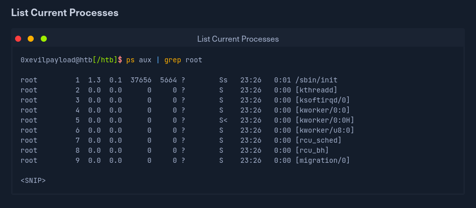
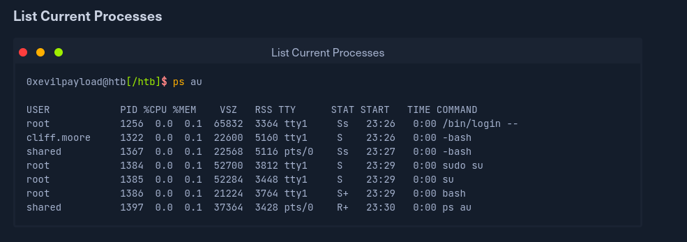
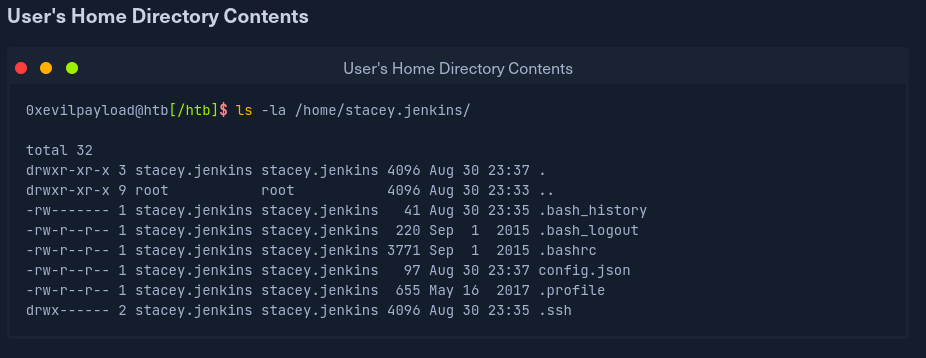
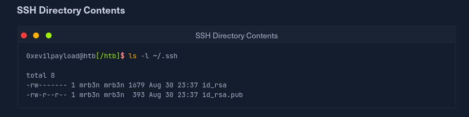
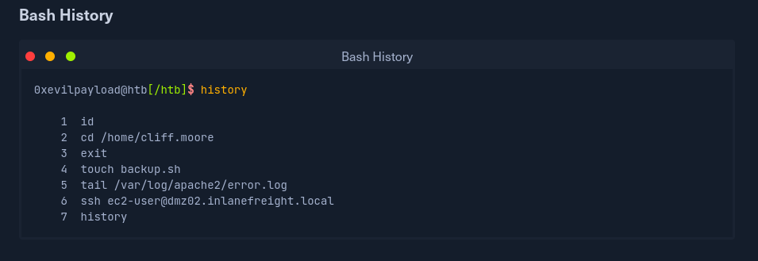
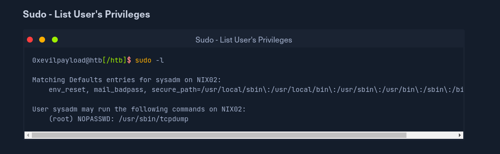
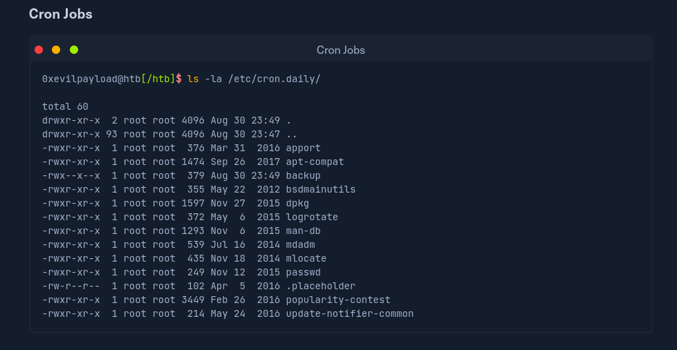
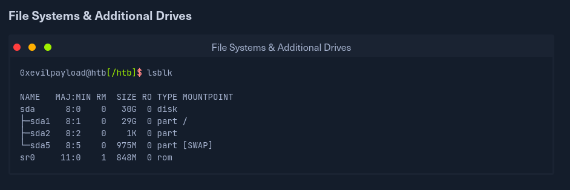
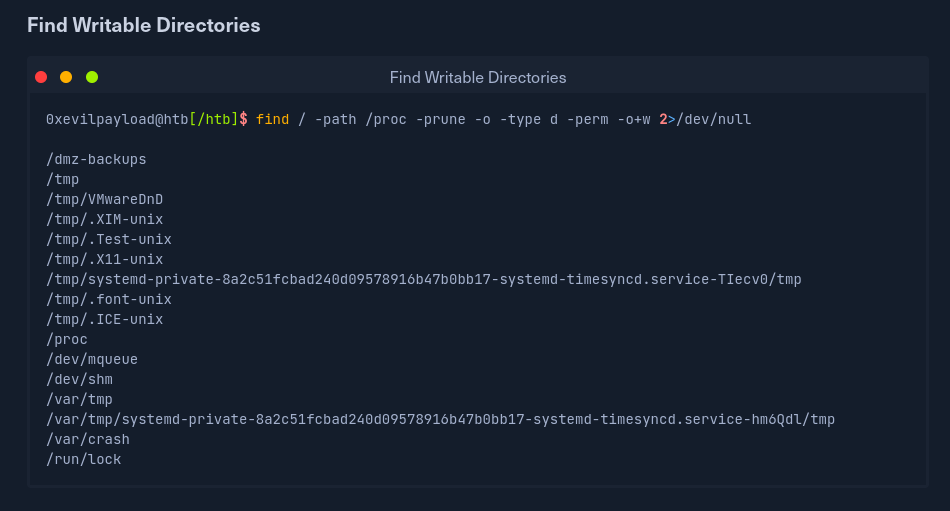
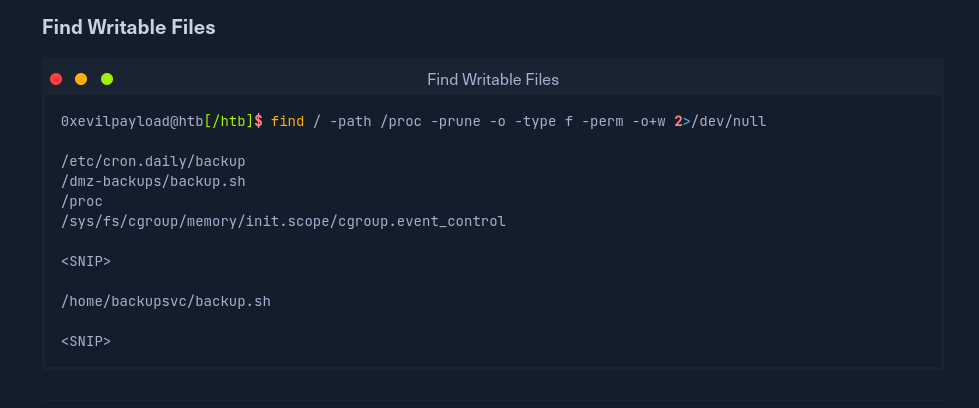

# Introduction to Linux Privilege Escalation

The root account on Linux systems provides full administrative level access to 
the operating system. During an assessment, you may gain a low-privileged shell
on a Linux host and need to perform privilege escalation to the root account. Fully
compromising the host would allow us to capture traffic and access sensitive files,
which may be used to further access within the enviroment. Additionally, if the Linux
machine is domain joined, we can gain the NTLM hash and begin enumerating and attacking
Active Directory.

## Enumeration

Enumeration is the key to privilege escalation. Several helper scripts (such as LinEnum)
exis to assist with enumeration. Still, it is also important to understand what pieces of
information to look for and to be able to perform your enumeration manually. When you
gain initial shell access to the host, it is important to check several key details.

### OS Version: 
Knowing the distribution (Ubuntu, Debian, FreeBSD, Fedora, SUSE, Red Hat,
CentOS, etc.) will give you an idea of the types of tools that may be available. This
would also identify the operating system version, for which there may be public exploits
available.

### Kernel Version: 
As with the OS version, these mayo be public exploits taht target a vul-
nerability in a specific kernel version. Kernel explois can cause system, and make sure
you fully understand the exploit and possible ramifications before running one.

### Running Service: 
Knowing what servodes are running on the host is imortant, especialy 
those running as root. a misconfigued or vulnerable service running as root
can be an easy win the profilie in linux privilege eslacation. Flaws have been discovered
in mnay common services such as Nagios, Exim, Samba, ProFTPD, etc. Public exploit PoCs exist for many of them, such as CVE-2019-9566, a local privileges escalation flaw with Nagios
core < 4.2.2

### Installed Packages and Versions:
Like running services, it is important to check for any out-od-date or
vulnerable packages taht may be easily leveraged for privilege 
escalation. An example is Screen, which is a common terminal multiplexer
(similar to tmux). It allows you to start a session and open many
windows or virtual terminals instead of opening multiple terminal sessions. 
Screen version 4.05.00 suffers from a privilege escalation vulneability 
thtat can be easily leveraged to escale privileges.

### Logged in Users:
Knowing which other users are logged in the system and what
tehy are doing can give greater into possible local lateral
movement and prtivilege escalation paths.

### User Homde Driectories: 
Are other user's home directories accessible? User home folders may
also contain SSH keys that can be used to access other systems or
scripts and configurations files containing credentials. It is not 
uncommon to find files containing credentials that can be leveraged
to access other systems or even gain entry into the Active Directory enviroment.

We can check infividual user directories and check to ses if files
such as the .bash_history file are readable and contain any
interesting commands, lok for configuracon filesm and check to see if we can obtain copies of a user's SSH keys.

If you find an SSH key for your current user, this could be used to
open an SSH session on the host (if SSH is exposed externally) and gain 
a stable and fully interactive session.
SSH keys could be leveraged to access other systems within the network as well.
At the minimum, check the ARP cache to ses what other hosts are being 
accessed and corss-reference these agains any useable SSH private keys

It is also important to check a user's bash history, as they may be
passing passwords as an argument on the command line, working git repositories,
setting up cron jobs, and omre, Reviewing what user hjas been doing
can give you considerable insight into the tpye of server you land
on and give a hint as to privilege escalation paths.

### Sudo Privileges:
Can the uses run any commands either as another use or as root? If
you do not have credentials for the user, it may not be possible to
leverage sudo permissions. However, often sudoer entries include
NOPASSWD, meaning that the user can dun the specified command
without being prompted ofr a password. Not all commands, even we can run as root,
will lead to privilege escalation. It is not uncommon to gain access as a user with
full sudo privileges, meaning they can run any command as root.
Issuing a simple sudo su command will immediately give you a root
session.

### Configuration Files:
Configuration files can hld a wealth of information. It is worth
searching through all files that end in extensions such as .conf
and .config, for usernames, passwords, and other secrets.

### Readbale Shadow File:
If the shadow file is readable, you will be able to gather passwords
hashes for all users who have a password set. While this does not
guarantee furhter access, these hashes can be subjected to an offline 
brute-force attack to revover the cleartext password.

### Password Hahses in /etc/passwd:
Occasionally, you will see password hashed directly in the /etc/passwd file.
This file is readable by all users, and with hashed in the shadow file, these 
can be subjected to an offline password cracking attack. This
configuration, while not common, can be sometimes be sesn or 
embedded devices and routers.

### Cron Jobs:
Cron jobs on Linux systems are similar to Windows scheduled tasks.
They are often set up perform aintenance and backup tasks, In 
conjuction with other misconfigurations such as relative paths or 
weak permissions, they can leverage to escalate privileges when
the scheduled cron job runs.

### Unmounted File Ssystems and Additional Drives:
If you discover and can mount an additional drive or umounted
file system, you may find sensitive files, passwords, or backups 
that can be leveraged to escalate privileges.

### SETUID and SETGEID Permissions:
Binaries are set with these permissios to allow a user to run a 
command as root, without having to grand root-level access to the
user. Mnay binaries contain functionality that can be exploited to get a root shell.

### Writeable Directories:
It is important to discover which directories are writeable if 
you need to download tools to the systems. You may discover a 
writeable directory where a cron job places files, whcih provides 
an idea of how ofteh the cron job runs and could be used to
elevate privileges if the script that the cron job runs is also
writeable.

### Writeable Files:
Are any scripts or configuration files world-writable? While altering
configuration files can be extremely descructive, there may be instances
where a minor modification can open up further access. Also, any 
scripts that are run as root using cron jobs can be modified slightly
to apend a command.

