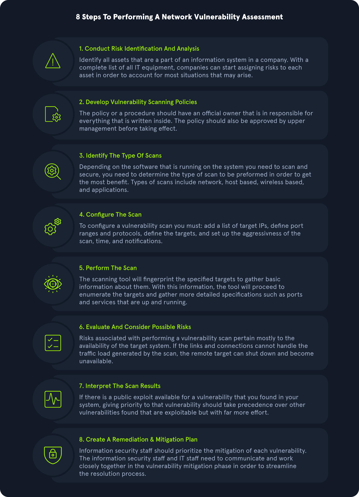

# Vulnerability Assessment.

A vulnerability assessment aims to identify and categorize risks for security
weaknesses related to assets within and environment. It is important that there 
is a little to no manual exploitation during a vulnerability assessment. A vulnerability
asessment also provides remediatios stemps to fix the issues.

The purpose of the vulneratbility asessement is to undestand, identify and categorize
the risk for the more apparent issues present in an environment without actually 
exploiting them to gain further access. Dependeing on the scope of the assessment,
some customers may ask us to validate as many vulnearibities as possible by performing
minimally invaisve exploitation to confirm the scanned findings and rule out false
positives. Other customers will ask for a report of all findings identified by the 
scanner. As with any aseessment, it is essential to calrify the scope and intent
of the Vulnerability assessment before starting. Vulnerability management is vital to
help organizations identify the weak points in their assets, undestand the risk level,
and calculate and prioritize remediatios efforts.

Now we gonna talk about the methodology for this rules.

## Methodology

Below is a sample Vulnerability Assessment methodology that most organizations could
follow and find success with. Methodologies may vary slightly from organization to
organization, but this cahrt covers the main steps, from identifying assets ot creating 
a remediations plan.

